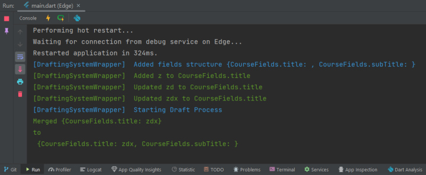

<!--
This README describes the package. If you publish this package to pub.dev,
this README's contents appear on the landing page for your package.

For information about how to write a good package README, see the guide for
[writing package pages](https://dart.dev/guides/libraries/writing-package-pages).

For general information about developing packages, see the Dart guide for
[creating packages](https://dart.dev/guides/libraries/create-library-packages)
and the Flutter guide for
[developing packages and plugins](https://flutter.dev/developing-packages).
-->

TODO: Put a short description of the package here that helps potential users
know whether this package might be useful for them.

## Features

Provides a logger that can be used with a simple one-liner. Can create simple logs for:

• Error 
• Warning 
• Info 
• Success




## Getting started

Just Download the package, import it, and start using.
```dart

import 'packages:simple_colored_logger/simple_colored_logger.dart';

void main(){
  
}
```

## Usage

TODO: Include short and useful examples for package users. Add longer examples
to `/example` folder.

```dart
const like = 'sample';
```

## Additional information

TODO: Tell users more about the package: where to find more information, how to
contribute to the package, how to file issues, what response they can expect
from the package authors, and more.
